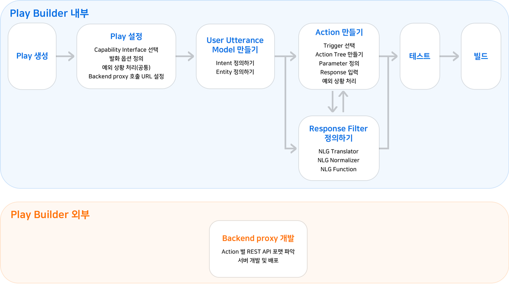

# Play Builder로 Play 만들기



Play를 만드는 과정은 크게 다음과 같습니다.

1. Play가 제공할 기능을 기획합니다.
2. 이 기능을 이용하기 위해 사용자가 어떻게 말할지를 예측합니다.
3. 사용자의 예상 발화에 대해 Play가 어떻게 응답할지를 정의합니다.

위 내용을 '날씨를 알려주는 Play'를 만드는 과정을 예로 살펴 보면 다음과 같습니다.\(이하 '날씨 Play'\)

## 1. Play가 제공할 기능을 기획합니다.

우리가 만들 '날씨 Play'에서는 '날씨 정보와 미세 먼지 정보' 두 가지만 알려줄 수 있다고 가정합니다.  
따라서 '날씨 Play'가 제공할 기능은 '날씨 정보 알림'과 '미세 먼지 정보 알림' 두 가지 기능입니다.

## 2. 이 기능을 이용하기 위해 사용자가 어떻게 말할지를 예측합니다.

정의된 문장들을 기반으로 Play Builder가 NLU 엔진을 학습시키며, NLU 엔진은 실제 사용자의 발화를 분석하여 어떤 의도가 있는지를 판단합니다.

## 3. Play에 기능을 구현하여, 사용자의 의도에 맞는 적절한 응답을 할 수 있도록 정의합니다.

응답은 음성 답변으로만 구현할 수 있으며, 특정 동작을 수행하거나 미디어를 컨트롤하는 등의 명령을 정의할 수도 있습니다.

단계별로 조금 더 상세히 살펴보면 다음과 같습니다.

다음 장\([아리아, 안녕!](hello-aria/)\)에서는 Play 만드는 법에 대해 간단하게 설명하고, 이후 각 과정에 대해 순서대로 상세하게 설명합니다.


Play Builder 내의 모든 상세 페이지에는 화면에 도움말이 직접 포함되어 있어 작업에 필요한 정보를 표시해 줍니다.  
화면 하단의 `도움말` 버튼을 통해 도움말을 켜고 끌 수 있습니다.



